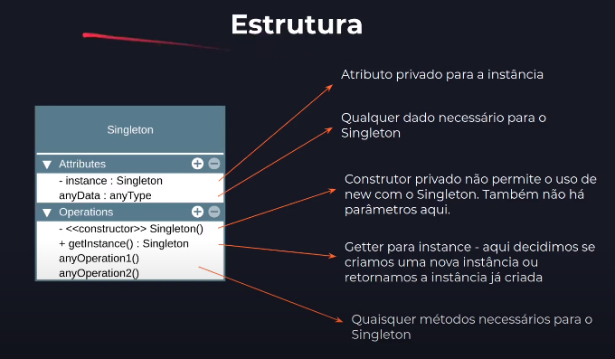

# Singleton Teoria

## Intenção oficial

Garantir que uma classe tenha somente uma instância no programa e fornecer um ponto de acesso global para a mesma

## Somente uma instância?

* Geralmente usado para acesso a *recursos compartilhados*, como acesso à base de dados, interfaces gráficas, sistemas de arquivos, servidores de impressão e mais.
* Também usado para substituir variáveis globais, como em casos de uso de **objetos de configuração do sistema** como um todo

## Ponto de acesso global?
* Você pode permitir acesso global ao Singleton em toda a sua aplicação, assim como fazíamos (ou fazemos) com variáveis globais.
* Uma vantagem do Singleton é que podemos proteger a instância com encapsulamento, evitando que outro código sobrescreva seu valor.

